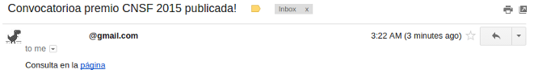

Node.js es una plataforma que permite ejecutar javascript  en servidores o nodos distintos de navegadores web. Hasta hace unos años el uso de este lenguaje estaba dedicado sólo para la programación web del lado del cliente pero con Node.js se abre la posibilidad de programar por medio de "funciones callback" o eventos también en servidores web, incluso Node.js ha ganado bastante popularidad en las aplicaciones CLI (de línea de comandos).


Nunca he sido amante de shell/bash como lenguaje, sin embargo el saber hacer scripts nos facilita tareas cotidianas enormemente. Recientemente me interesé en saber cuándo publicarán la convocatoria para el premio de Seguros y Fianzas de la CNSF y a la fecha no existe. Entonces conociendo javascript y queriendo aprender más de Node.JS pensé hacer un pequeño script que se inicie cuando arranque mi computadora con Ubuntu y éste me avise por correo electrónico cuando se publique la página con la convocatoria.


Node.js cuenta con un administrador de paquetes y dependencias llamado npm, el cual es de fácil uso y goza de gran apoyo de la comunidad, antes de emprender algo en Node, busca si ya existe algo similar en npm, para este caso usaremos:


 - [request](https://www.npmjs.com/package/request)
 - [nodemailer](https://www.npmjs.com/package/nodemailer)


### ¿Cómo saber si ya se publicó la convocatoria?

Para saber si ya se publicó la convocatoria del concurso, usaré un script de un proyecto publicado en Github llamado [node-app](https://github.com/chovy/node-startup/blob/master/init.d/node-app), el cual permite programar la ejecución de scripts en Node.js al arrancarsistemas Linux (/etc/init.d para los linuxeros). En este caso usaré Ubuntu pero debe funcionar con las configuraciones apropiadas otras distribuciones.

Las convocatorias y resultados de ganadores de ediciones anteriores del concurso se encuentran en:


 - http://cnsf.gob.mx/Eventos/Paginas/Premios_2012.aspx
 - http://cnsf.gob.mx/Eventos/Paginas/Premios_2013.aspx
 - http://cnsf.gob.mx/Eventos/Paginas/Premios_2014.aspx

 
Entonces la idea es hacer una petición HTTP a http://cnsf.gob.mx/Eventos/Paginas/Premios_2015.aspx esperando que ahí se publique la información cuando esté disponible. Esto se puede hacer por medio de una petición HTTP donde sólo nos interesan los headers de respuesta (200 para ok y 400 para no encontrado y es donde usamos request del repositorio npm).

### Instalación de Node.js y dependencias npm

Primero requerimos tener Node.js y npm instalados, la forma más fácil para empezar a probarlo en Ubuntu es:

```bash
$ sudo apt-get install nodejs
$ sudo apt-get install npm
```

Luego instalamos las dependencias con estos comandos de npm:

```bash
$ npm install nodemailer
$ npm install nodemailer-smtp-transport
$ npm install request
```

### Script sh/bash (/etc/init.d/alerta-cnsf)

Una vez instalado todo, creamos el archivo /etc/init.d/alerta-cnsf:

```bash
$ sudo gedit /etc/init.d/alerta-cnsf
```

Y copiamos el contenido del template de [node-app](https://github.com/chovy/node-startup/blob/master/init.d/node-app) y lo adecuamos a la configuración que queramos. Este archivo contiene un código sh (shell, bash) que ejecutará el script en Node.js al iniciar Ubuntu. El mío quedó así:

<script src="https://gist.github.com/ivansabik/cd70ca34e82403c66781.js"></script>

Finalmente hay que ejecutar:

```
$ update-rc.d alerta-cnsf defaults
```

### El ~~script de java~~ javascript (~/scripts-startup/cnsf.js)

El script usa la función setInterval() para intentar realizar la petición HTTP y validar lo que sea necesario cada cierto tiempo hasta un máximo de 10 intentos. Esto se necesita porque al ejecutarse el script en el arranque, tenemos que esperar a que haya conexión a internet y esto puede tardar un poco.

<script src="https://gist.github.com/ivansabik/bc4ed7f2cc4ad118eb8d.js"></script>

### Probando que funciona

Listo, si todo salió bien al reiniciar, se ejecutará el javascript pero podemos ver si funciona ejecutándolo como cualquier otro programa de Node.js:

```bash
$ node ~/scripts-startup/cnsf.js
-------------------------
Tue Apr 07 2015 03:11:08 GMT-0500 (CDT)
Iniciando cnsf.js...
Intento 1
Tue Apr 07 2015 03:11:08 GMT-0500 (CDT)
Pagina http://www.cnsf.gob.mx/Eventos/Paginas/Premios_2015.aspx responde "404"
```

Y para probar que funciona el envío del correo se cambia temporalmente esta línea:

```javascript
if(res.statusCode === 200) {
``` 

Por:

```javascript
if(res.statusCode) {
```
 
Y volver a correr el script:

```bash
$ node ~/scripts-startup/cnsf.js
-------------------------
Tue Apr 07 2015 03:22:04 GMT-0500 (CDT)
Iniciando cnsf.js...
Intento 1
Enviando mail
Enviado!
Respuesta "250 2.0.0 OK 1428394926 c41sm5809909yhc.53 - gsmtp"
```



¡Y sí son las tres de la mañana entonces ya no voy a corregir el "Convocatorioa"!

Feliz y productivo scripting con Javascript y Node.js...
